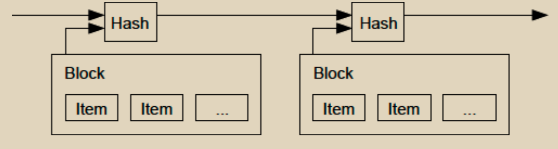

# 时间戳服务器

<figure><figcaption></figcaption></figure>

我们提出的解决方案始于一个时间戳服务器。时间戳服务器的工作方式是对要进行时间戳处理的数据块进行哈希，并广泛发布该哈希值，比如在报纸或Usenet帖子中\[2-5]。时间戳证明了数据必须在某个时间点存在，显然，为了被包含在哈希中。每个时间戳在其哈希中包含了前一个时间戳，形成一个链条，每个额外的时间戳都加强了之前的时间戳。
